# HeatTheMap - Kapsamli Teknik Analiz Dokumani

> **Olusturulma Tarihi**: 2026-03-08
> **Proje**: HeatTheMap - Magaza Ici Ziyaretci Analitik Platformu
> **Versiyon**: MVP (Minimum Viable Product)

---

## Icindekiler

1. [Proje Genel Yapisi](#1-proje-genel-yapisi)
2. [Backend Analizi](#2-backend-analizi)
3. [Veritabani Semasi ve Veri Modelleri](#3-veritabani-semasi-ve-veri-modelleri)
4. [Frontend Analizi](#4-frontend-analizi)
5. [Kamera Tespiti / Video Isleme Sistemi](#5-kamera-tespiti--video-isleme-sistemi)
6. [Chatbot Sistemi](#6-chatbot-sistemi)
7. [Authentication / Authorization Sistemi](#7-authentication--authorization-sistemi)
8. [Analytics / Dashboard Sistemi](#8-analytics--dashboard-sistemi)
9. [Entry Line Tracking Sistemi](#9-entry-line-tracking-sistemi)
10. [Gercek Zamanli Iletisim](#10-gercek-zamanli-iletisim)
11. [Sistem Akis Diyagrami (Uctan Uca)](#11-sistem-akis-diyagrami-uctan-uca)
12. [Is Kurallari Ozeti](#12-is-kurallari-ozeti)
13. [Teknik Borc ve Iyilestirme Alanlari](#13-teknik-borc-ve-iyilestirme-alanlari)

---

## 1. Proje Genel Yapisi

### 1.1 Mimari Desen

Proje, **.NET Aspire** orkestrasyon frameworku ile yonetilen bir **monorepo** yapisindadir. 3 ayri proje icerir:

| Proje | Rol | Teknoloji |
|-------|-----|-----------|
| `heatTheMap` (root) | Aspire AppHost - Orkestrasyon | .NET 10, Aspire 9.4.2 |
| `HeatTheMap.Api` | Backend REST API | ASP.NET Core 10, EF Core 10, PostgreSQL |
| `HeatTheMap.Web` | Frontend SPA | React 19, TypeScript, Vite 7, TailwindCSS 4 |
| `HeatTheMap.ServiceDefaults` | Paylasilan altyapi servisleri | OpenTelemetry, Health Checks, Service Discovery |

### 1.2 Klasor Yapisi

```
heatTheMap/
  AppHost.cs                          -- Aspire orkestrator (PostgreSQL + API + Web)
  heatTheMap.csproj                   -- Aspire AppHost projesi
  global.json                         -- .NET SDK 10.0.0
  HeatTheMap.Api/
    Controllers/                      -- 6 controller
    Services/                         -- 4 servis arayuzu + implementasyon
    Repositories/                     -- Generic + Analytics repository
    DTOs/                             -- 4 DTO dosyasi
    Data/
      Entities/                       -- 5 entity sinifi
      HeatMapDbContext.cs             -- EF Core DbContext
      DataSeeder.cs                   -- Seed verisi
    Program.cs                        -- API baslangic noktasi
  HeatTheMap.Web/
    src/
      pages/                          -- 5 sayfa bileseni
      components/
        chatbot/                      -- 3 chatbot bileseni
        dashboard/                    -- 8 dashboard bileseni
        detection/                    -- 4 detection bileseni
        filters/                      -- 2 filtre bileseni
        layout/                       -- 3 layout bileseni
        zone/                         -- 1 entry line editor
      hooks/                          -- 4 custom hook
      services/                       -- 4 API servis modulu
      stores/                         -- 2 Zustand store
      lib/                            -- 5 yardimci kutuphane
      types/                          -- 2 tip tanimi dosyasi
  HeatTheMap.ServiceDefaults/         -- OpenTelemetry, Resilience
```

### 1.3 Kullanilan Teknolojiler

**Backend:**
- .NET 10 (preview), ASP.NET Core
- Entity Framework Core 10 + Npgsql (PostgreSQL)
- JWT Authentication (Microsoft.AspNetCore.Authentication.JwtBearer)
- .NET Aspire 9.4.2 (orkestrasyon, service discovery, health checks)
- OpenTelemetry (distributed tracing, metrikleri)
- HttpClient Factory (Ollama + Kamera proxy)

**Frontend:**
- React 19.2 + TypeScript 5.9
- Vite 7.2 (build tool)
- TailwindCSS 4.1 (styling)
- Zustand 5 (state management)
- TanStack React Query 5 (server state)
- Recharts 3.6 (grafikler)
- TensorFlow.js 4.22 + COCO-SSD 2.2 (tarayici icinde nesne algilama)
- Three.js 0.183 + React Three Fiber 9.5 (3D gorselestirme)
- HLS.js 1.6 (HLS video akisi)
- date-fns 4.1 (tarih islemleri)
- Axios (HTTP istekleri)

**Altyapi:**
- PostgreSQL (Aspire tarafindan yonetilir, pgAdmin dahil)
- Ollama (yerel LLM - llama3.1 modeli)

### 1.4 Orkestrasyon (AppHost.cs)

```
AppHost.cs akisi:
1. PostgreSQL konteyneri baslatilir (pgAdmin + data volume ile)
2. "heatmapdb" veritabani olusturulur
3. API projesi baslatilir (heatmapdb referansi + Ollama URL)
4. React web uygulamasi npm ile baslatilir (API referansi + port 5173)
```

Tum servisler arasi baglanti Aspire service discovery ile otomatik yonetilir.

---

## 2. Backend Analizi

### 2.1 Program.cs Baslangic Akisi

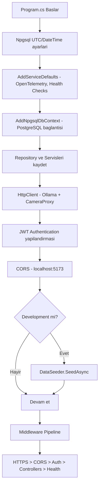

### 2.2 API Endpoints Tablosu

| Controller | Yol | Metot | Yetki | Aciklama |
|---|---|---|---|---|
| **AuthController** | `POST /api/auth/login` | Login | AllowAnonymous | Kullanici girisi, JWT token dondurur |
| | `POST /api/auth/refresh` | RefreshToken | AllowAnonymous | Refresh token ile yeni JWT alinir |
| **StoresController** | `GET /api/stores` | GetAll | Authorize | Tum magazalari listeler |
| | `GET /api/stores/{id}` | GetById | Authorize | Tek magaza getirir |
| | `POST /api/stores` | Create | Authorize | Yeni magaza olusturur |
| | `PUT /api/stores/{id}` | Update | Authorize | Magaza gunceller |
| | `DELETE /api/stores/{id}` | Delete | Authorize | Magaza siler |
| **AnalyticsController** | `GET /api/analytics/daily-summary` | GetDailySummary | Authorize | Gunluk ozet (ziyaretci, peak, degisim) |
| | `GET /api/analytics/weekly-trends` | GetWeeklyTrends | Authorize | Haftalik trendler (7 gun) |
| | `GET /api/analytics/hourly-distribution` | GetHourlyDistribution | Authorize | Saatlik giris/cikis dagilimi |
| | `GET /api/analytics/zone-performance` | GetZonePerformance | Authorize | Zon performansi (sicak/soguk zonlar) |
| | `GET /api/analytics/peak-hours` | GetPeakHours | Authorize | Son N gundeki peak saatler |
| | `GET /api/analytics/heatmap/latest` | GetLatestHeatmap | Authorize | En son heatmap grid verisi |
| | `POST /api/analytics/detection` | PostDetection | Authorize | Kameradan tespit verisini gonderir |
| **ChatController** | `POST /api/chat` | Chat | Authorize | Dogal dil sorgusu -> AI cevabi |
| **EntryLinesController** | `GET /api/entrylines/store/{storeId}` | GetByStoreId | Authorize | Magazanin aktif entry line bilgisi |
| | `POST /api/entrylines` | Create | Authorize | Yeni entry line olusturur |
| | `PUT /api/entrylines/{id}` | Update | Authorize | Entry line gunceller |
| | `DELETE /api/entrylines/{id}` | Delete | Authorize | Entry line siler (soft delete) |
| **CameraProxyController** | `GET /api/camera/proxy` | ProxyStream | Authorize | IP kamera akisini proxy eder |
| **WeatherForecastController** | `GET /weatherforecast` | Get | Yok | Sablon controller (kullanilmiyor) |

### 2.3 Servis Katmani

#### AuthService (`Services/AuthService.cs`)
- Kimlik dogrulama konfigurasyon tabanlidir (`appsettings.json`'dan `Auth:DefaultUsername` ve `Auth:DefaultPassword` okunur)
- Varsayilan: `admin` / `password`
- JWT token suresi: 1 saat
- Refresh token bellek ici (in-memory Dictionary) saklanir [MVP kisitlamasi]
- Token claim'leri: Name, Role ("Admin"), Jti, Sub

#### AnalyticsService (`Services/AnalyticsService.cs`)
- `GetDailySummaryAsync`: Gunluk ziyaretci, ortalama kalma suresi (rotalardan hesaplanir), peak saat, haftalik degisim yuzdesi, anlik doluluk (heatmap'ten hesaplanir)
- `GetWeeklyTrendsAsync`: 7 gunluk footfall verisini gruplara ayirip gun bazli toplam ziyaretci + peak doluluk hesaplar, onceki haftayla karsilastirir
- `GetHourlyDistributionAsync`: Belirli gune ait saatlik giris/cikis sayilari
- `GetZonePerformanceAsync`: Heatmap matrislerini zon bazli biriktirir, en sicak 5 ve en soguk 5 zonu belirler
- `GetPeakHoursAsync`: Son N gunun saatlik ortalamalarini hesaplayip en yogun 5 saati bulur
- `GetLatestHeatmapDataAsync`: En son heatmap grid verisini dondurur
- `SubmitDetectionAsync`: Kameradan gelen tespit verisini footfall tablosuna upsert eder + opsiyonel heatmap verisi ekler

#### OllamaService (`Services/OllamaService.cs`)
- Ollama API'sine (llama3.1 modeli) baglanti kurar
- Function calling destegi ile 4 fonksiyon tanimlanir:
  - `get_daily_summary`: Gunluk ozet
  - `get_weekly_comparison`: Haftalik karsilastirma
  - `get_busiest_hours`: En yogun saatler
  - `get_zone_performance`: Zon performansi
- Akis: Kullanici sorusu -> Ollama'ya gonderilir -> Ollama fonksiyon cagrisi yaparsa sonuc alinir -> Sonuc tekrar Ollama'ya gonderilir -> Dogal dil cevabi uretilir
- Ollama mevcut degilse, anahtar kelime tabanli fallback yanit sistemi devreye girer (Turkce + Ingilizce anahtar kelimeler)
- Sistem promptu: Retail analytics asistani, kisaca 2-3 cumle, Turkce/Ingilizce dil destegi

#### EntryLineService (`Services/EntryLineService.cs`)
- Bir magaza icin yalnizca 1 aktif entry line olabilir (yeni olusturuldiginda eskileri deaktive edilir)
- Silme islemi soft delete seklindedir (`IsActive = false`)

### 2.4 Repository Katmani

#### Generic Repository (`Repository<T>`)
- CRUD islemleri: GetById, GetAll, Find, Add, Update, Delete, Exists
- EF Core DbSet uzerinden calisir

#### AnalyticsRepository (`AnalyticsRepository`)
- Footfall sorgulari (tarih araligi, tek gun)
- Heatmap sorgulari (en son, tarih araligi)
- Rota sorgulari (tarih araligi)
- Toplam ziyaretci ve peak saat hesaplari
- **UpsertFootfallAsync**: Ayni StoreId + Date + Hour kaydi varsa EntryCount ve ExitCount'u toplar, PeakOccupancy'de max degerini alir; yoksa yeni kayit olusturur

---

## 3. Veritabani Semasi ve Veri Modelleri

### 3.1 Entity-Relationship Diyagrami

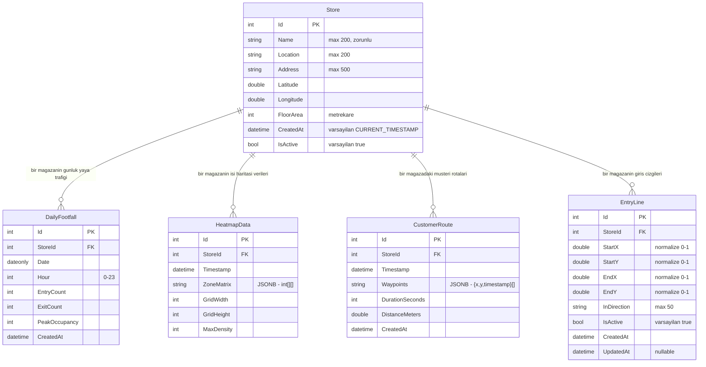

### 3.2 Veritabani Kurallari

| Kural | Konum | Aciklama |
|-------|-------|----------|
| Tekil indeks: StoreId + Date + Hour | DailyFootfall | Ayni saat diliminde yalnizca 1 kayit |
| JSONB tip | HeatmapData.ZoneMatrix, CustomerRoute.Waypoints | PostgreSQL JSONB olarak saklanir |
| Cascade silme | Tum iliskiler | Magaza silindiginde bagli tum veriler silinir |
| Composite indeks | EntryLine(StoreId, IsActive) | Aktif entry line sorgulari icin |
| DateTime UTC | Tum tarih alanlari | `timestamp with time zone` olarak saklanir |

### 3.3 Seed Verisi (DataSeeder)

Development ortaminda otomatik olarak seed verisi olusturulur:
- **2 magaza**: "Downtown Flagship" (New York), "Suburban Mall" (Los Angeles)
- **720 DailyFootfall kaydi**: Her magaza icin 30 gun x 12 saat (09:00-21:00), yogun saatlere gore varyans
- **168 HeatmapData kaydi**: Her magaza icin 7 gun x 12 saat, 20x15 grid rastgele heatmap
- **200 CustomerRoute kaydi**: Her magaza icin 100 rota, 5-15 waypoint

---

## 4. Frontend Analizi

### 4.1 Routing Yapisi

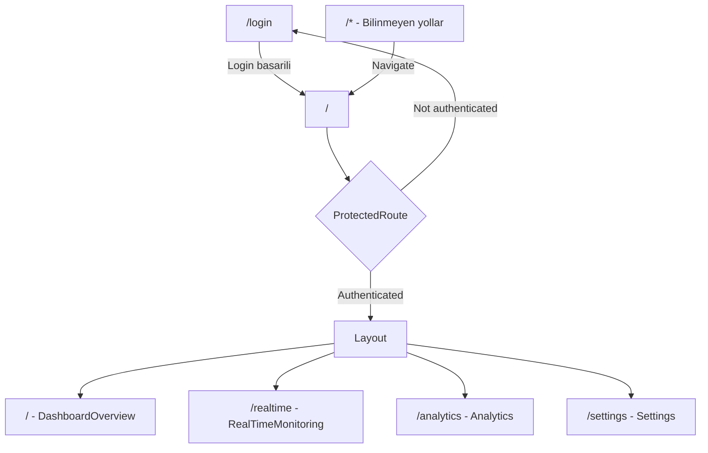

### 4.2 State Management

**Zustand Store'lari:**

| Store | Dosya | State | Aciklama |
|-------|-------|-------|----------|
| `useAuthStore` | `stores/useAuthStore.ts` | `isAuthenticated`, `username` | Login/logout/checkAuth islemleri |
| `useFilterStore` | `stores/useFilterStore.ts` | `selectedStore`, `dateRange` | Secili magaza ve tarih araligi |

**React Query Hook'lari (Server State):**

| Hook | Cache Key | Yenileme | Aciklama |
|------|-----------|----------|----------|
| `useDailySummary` | `['dailySummary', storeId, date]` | 60 sn | Gunluk ozet |
| `useWeeklyTrends` | `['weeklyTrends', storeId, startDate]` | 5 dk stale | Haftalik trendler |
| `useHourlyDistribution` | `['hourlyDistribution', storeId, date]` | Varsayilan | Saatlik dagilim |
| `useZonePerformance` | `['zonePerformance', storeId, start, end]` | Varsayilan | Zon performansi |
| `usePeakHours` | `['peakHours', storeId, days]` | Varsayilan | Peak saatler |
| `useStores` | `['stores']` | staleTime: Infinity | Magaza listesi |
| `useLatestHeatmap` | `['latestHeatmap', storeId]` | 30 sn | Son heatmap |
| `useEntryLine` | `['entryLine', storeId]` | staleTime: Infinity | Entry line |
| `useSubmitDetection` | mutation | Basarida invalidate: heatmap, summary, hourly | Tespit gonderimi |
| `useChat` | mutation | - | Chat mesaji gonderimi |
| `useSaveEntryLine` | mutation | Basarida invalidate: entryLine | Entry line kaydi |

### 4.3 Sayfa Bilesenleri

#### Login Sayfasi (`pages/Login.tsx`)
- Username + password formu
- Zustand store uzerinden login
- Demo bilgileri gorunur: "admin / password"
- Hata gosterimi, loading durumu

#### DashboardOverview (`pages/DashboardOverview.tsx`)
- 4 KPI karti (Today's Visitors, Average Stay, Peak Hour, Current Occupancy)
- 2D/3D heatmap gorselestirme
- Sistem durumu paneli (Entry Line durumu, API baglantisi)
- Magaza secilmemisse uyari mesaji

#### RealTimeMonitoring (`pages/RealTimeMonitoring.tsx`)
- Sol tarafta: DetectionPanel (kamera beslemesi + nesne algilama)
- Sag tarafta: Entry Line Ayarla butonu + Mini Heatmap
- Entry Line Editor modal penceresi

#### Analytics (`pages/Analytics.tsx`)
- Tarih araligi secici (Baslangic + Bitis + Bugun butonu)
- Saatlik Dagilim grafigi (tam genislik)
- Haftalik Trendler + Zon Karsilastirma grafikleri (yan yana)

#### Settings (`pages/Settings.tsx`)
- Magaza bilgileri (ad, konum, adres, alan)
- Entry Line yapilandirmasi (inline mod)

### 4.4 Layout Yapisi

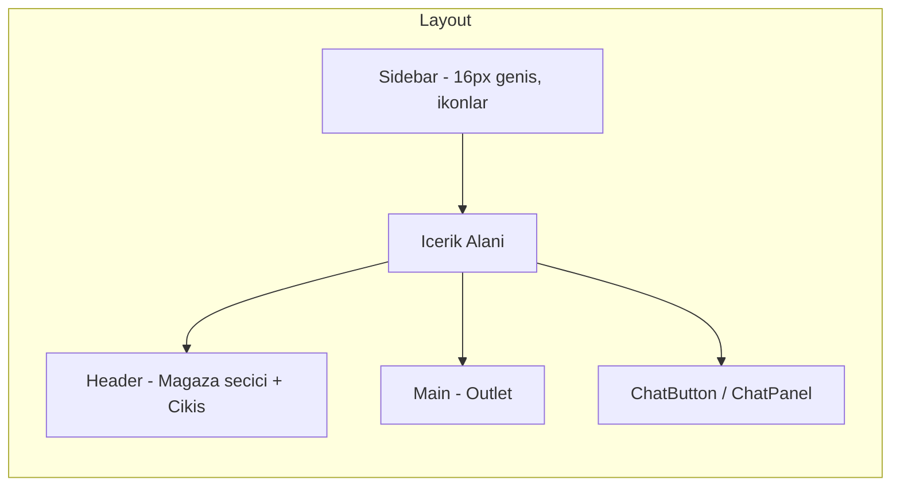

- **Sidebar**: Dar ikon-tabanli navigasyon (Dashboard, Canli Izleme, Analitik, Ayarlar) + kullanici avatari
- **Header**: Sayfa basligi + magaza dropdown secici + kullanici adi + Cikis butonu
- **ChatButton**: Sag alt kose sabit konum FAB butonu
- **ChatPanel**: Sag alt kose 396x600px sabit konum sohbet paneli

---

## 5. Kamera Tespiti / Video Isleme Sistemi

Bu, projenin en teknik ve karmasik parcasidir. Tum islem **tamamen tarayici ici (client-side)** gerceklesir.

### 5.1 Video Kaynak Secimi

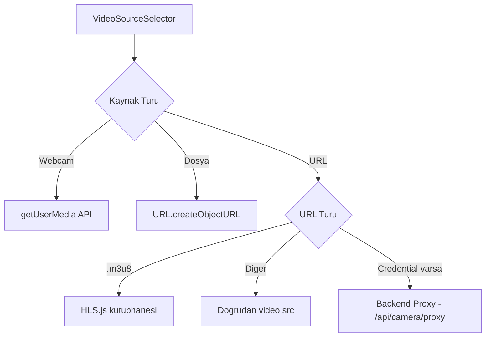

- **Webcam**: Cihaz kamerasi (640x480, arka kamera tercihli)
- **Dosya**: Yerel video dosyasi (loop modda)
- **URL / IP Kamera**: MJPEG, HLS (.m3u8) veya dogrudan video URL, opsiyonel Basic Auth kimlik dogrulamasi

### 5.2 Nesne Algilama Pipeline'i

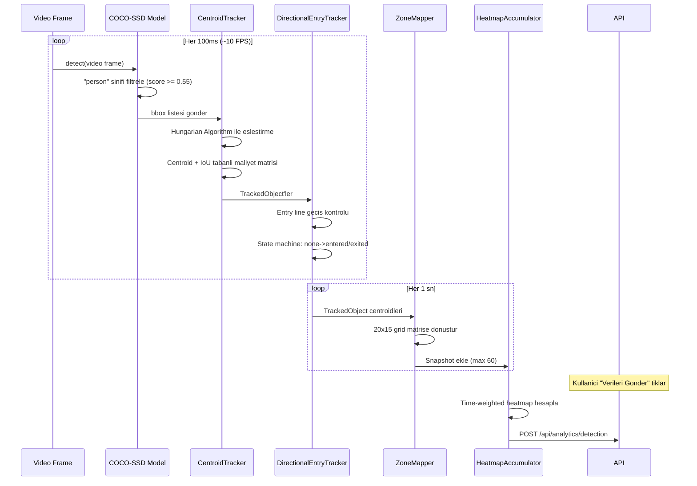

### 5.3 CentroidTracker (`lib/centroidTracker.ts`)

Nesne takip algoritmasinin temel bileseni:

- **Hungarian (Munkres) Algoritmasi**: Optimal maliyet eslestirmesi icin kullanilir (`hungarian.ts`)
- **Maliyet Fonksiyonu**: `centroidDist * (1 - IoU * 0.5)` -- Centroid mesafesi + IoU (Intersection over Union) birlesimidir
- **Adaptif Mesafe Esigi**: Bounding box diagonaline gore dinamik olarak ayarlanir: `max(100, diagonal * 0.75)`
- **Kaybolma Esigi**: 30 frame boyunca gorulmezse nesne silinir
- **Onaylama Esigi**: 3 frame boyunca takip edilen nesne "onaylanmis" (unique) sayilir
- **TrackedObject Ozellikleri**: `id`, `centroid`, `previousCentroid`, `bbox`, `disappeared`, `crossingState`, `trackAge`, `entryTime`

### 5.4 DirectionalEntryTracker (`lib/directionalEntryTracker.ts`)

Entry line gecis algilama sistemi:

**State Machine:**

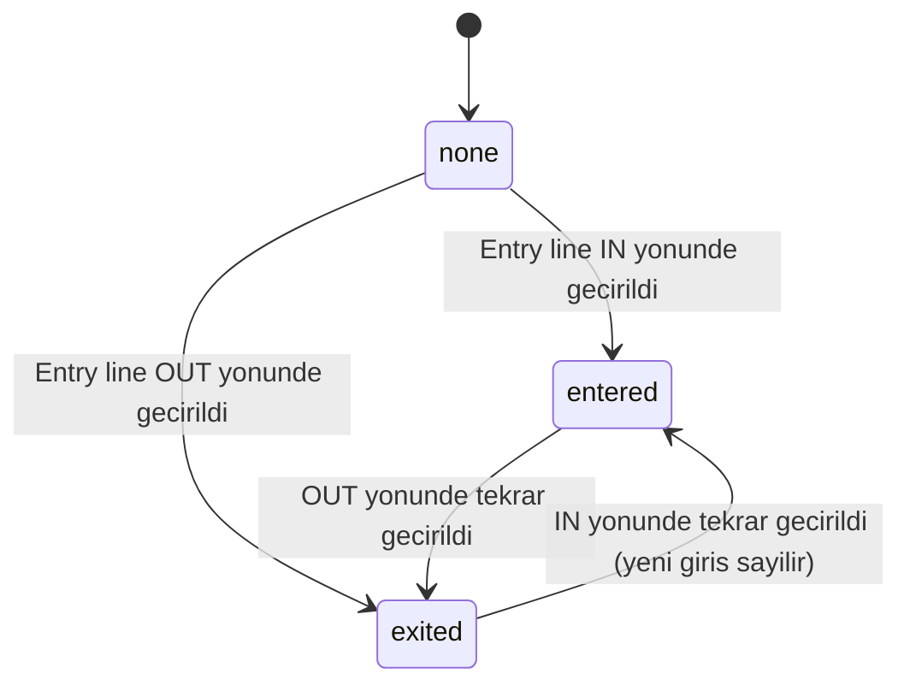

**Is Kurallari:**
1. Gecis tespiti icin **cizgi kesisim algoritmasi** kullanilir (cross product tabanli)
2. Track yasi en az 3 frame olmalidir (phantom track onlemi)
3. Son gecisten beri en az 1000ms beklenmeli (cooldown suresi)
4. Giris yonu 4 secenekli: `left-to-right`, `right-to-left`, `top-to-bottom`, `bottom-to-top`
5. Entry line koordinatlari normalize (0-1) saklanir, runtime'da video boyutlarina gore olceklenir

### 5.5 Heatmap Olusturma

#### ZoneMapper (`lib/zoneMapper.ts`)
- Video cozunurlugunu 20x15 grid'e donusturur
- Her TrackedObject'in centroid'i ilgili grid hucresine eslestirilir
- Birden fazla kisi ayni hucredeyse deger artar

#### HeatmapAccumulator (`lib/heatmapAccumulator.ts`)
- Her saniye bir snapshot alinir (en fazla 60 snapshot saklanir)
- `getTimeWeightedHeatmap()`: Tum snapshot'lari toplayarak birikimli heatmap uretir
- "Verileri Gonder" tiklandiginda bu birikimli heatmap API'ye gonderilir ve accumulator sifirlanir

### 5.6 SSRF Korumasi (CameraProxyController)

Backend kamera proxy'si yalnizca ozel ag IP araliklarina izin verir:
- `10.0.0.0/8`
- `172.16.0.0/12`
- `192.168.0.0/16`
- `127.0.0.0/8`

DNS cozumlemesi yapilarak hedef adresin bu aralikta olup olmadigi kontrol edilir.

---

## 6. Chatbot Sistemi

### 6.1 Mimari

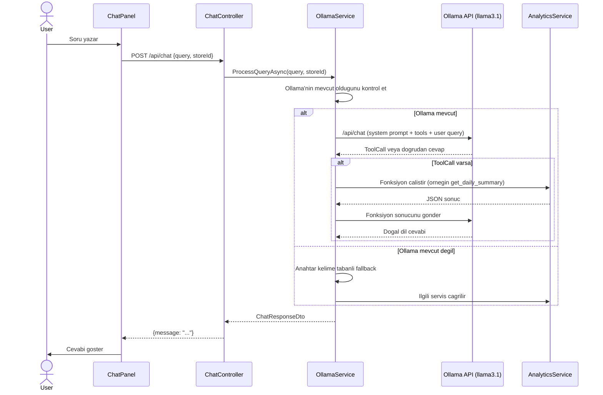

### 6.2 Fonksiyon Tanimlari (Tool Calling)

Ollama'ya tanimlanan 4 fonksiyon:

| Fonksiyon | Aciklama | Parametreler |
|-----------|----------|--------------|
| `get_daily_summary` | Gunluk ziyaretci, peak saat, ortalama kalma, haftalik degisim | `date` (YYYY-MM-DD) |
| `get_weekly_comparison` | Haftalik karsilastirma | `startDate` (YYYY-MM-DD) |
| `get_busiest_hours` | En yogun saatler | `days` (integer) |
| `get_zone_performance` | Sicak/soguk zonlar | `startDate`, `endDate` |

### 6.3 Fallback Sistemi

Ollama mevcut degilse anahtar kelime tabanli fallback aktif olur:
- `"today"` / `"bugun"` --> Gunluk ozet
- `"week"` / `"hafta"` --> Haftalik trendler
- `"busiest"` / `"peak"` / `"yogun"` --> Peak saatler
- Diger --> Genel yardim mesaji + Ollama uyarisi

### 6.4 Sistem Promptu

```
You are a helpful retail analytics assistant for HeatTheMap.
You help store managers understand their foot traffic data, visitor patterns, and store performance.
When users ask questions about store analytics, use the available functions to retrieve accurate data.
Provide concise, conversational responses with specific numbers and insights.
If asked in Turkish, respond in Turkish. If asked in English, respond in English.
Keep answers brief but informative - aim for 2-3 sentences maximum.
```

### 6.5 Frontend Chat Bilesenleri

- **ChatButton**: Sag alt kosede sabitlenen FAB (Floating Action Button), tiklandiginda ChatPanel acar
- **ChatPanel**: 396x600px boyutlarinda sohbet penceresi, mesaj gecmisi + input alani
- **ChatMessage**: Kullanici ve asistan mesajlarini farkli renk/pozisyon ile gosterir

---

## 7. Authentication / Authorization Sistemi

### 7.1 Akis Diyagrami

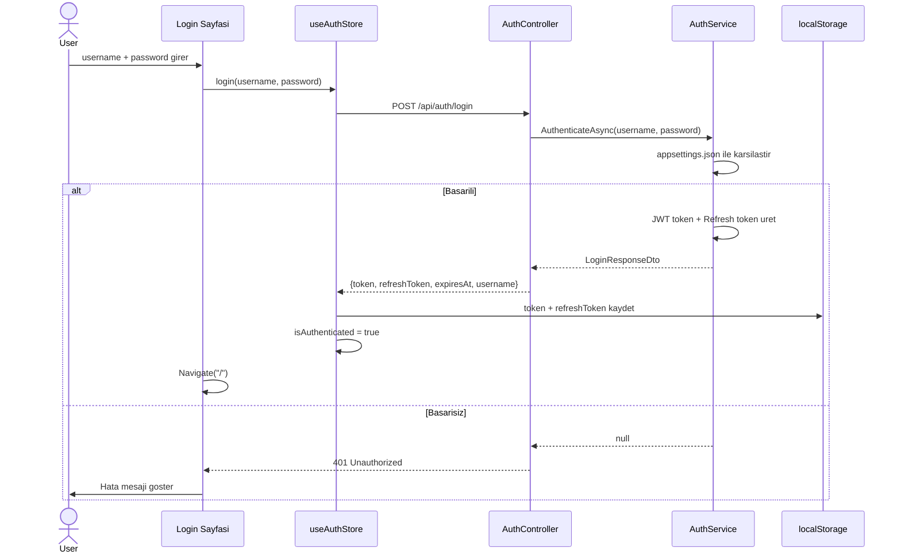

### 7.2 Token Yenileme (Interceptor)

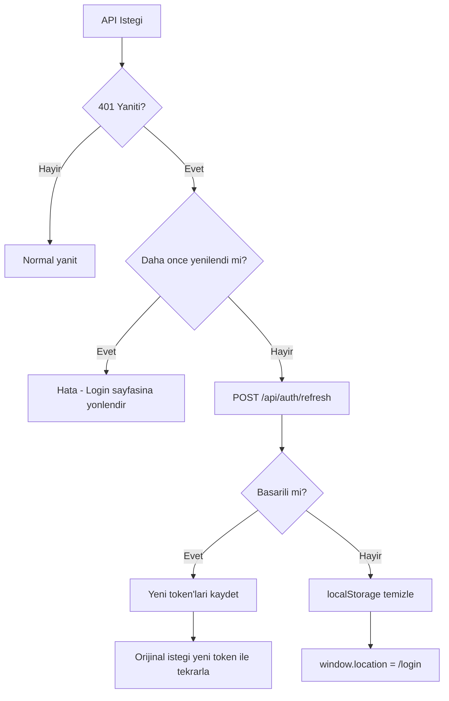

### 7.3 Guvenlik Ozellikleri

| Ozellik | Deger | Konum |
|---------|-------|-------|
| JWT algoritmasi | HmacSha256 | AuthService.cs |
| Token suresi | 1 saat | AuthService.cs |
| Refresh token | 32 byte rastgele (Base64) | AuthService.cs |
| Refresh token saklama | In-memory Dictionary | AuthService.cs [MVP Kisitlamasi] |
| Issuer | HeatTheMap.Api | appsettings.json |
| Audience | HeatTheMap.Web | appsettings.json |
| Varsayilan rol | Admin | AuthService.cs |
| CORS | localhost:5173 | Program.cs |
| ProtectedRoute | Zustand state kontrolu | ProtectedRoute.tsx |

**Onemli Notlar:**
- **[MVP KISITLAMASI]** Refresh token'lar bellekte saklanir, sunucu yeniden baslatildiginda tum token'lar kaybolur
- **[MVP KISITLAMASI]** Tek kullanici (admin) destegi vardir, kullanici yonetimi yoktur
- **[MVP KISITLAMASI]** Rol tabanli erisim kontrolu henuz uygulanmamistir (tum endpoint'ler `[Authorize]` attribute ile korunur, rol ayirimi yapilmaz)

---

## 8. Analytics / Dashboard Sistemi

### 8.1 KPI Kartlari

Dashboard 4 temel KPI kartina sahiptir:

| KPI | Hesaplama | Kaynak |
|-----|-----------|--------|
| Today's Visitors | `SUM(DailyFootfall.EntryCount) WHERE Date = today` | AnalyticsRepository.GetTotalVisitorsAsync |
| Average Stay | `AVG(CustomerRoute.DurationSeconds) WHERE Date = today` | AnalyticsRepository.GetRoutesByDateRangeAsync |
| Peak Hour | `MAX(DailyFootfall.EntryCount) SAAT` | AnalyticsRepository.GetPeakHourAsync |
| Current Occupancy | `SUM(HeatmapData.ZoneMatrix tum hucreleri)` en son kayittan | AnalyticsService.GetDailySummaryAsync |
| Weekly Change | `((this_week - last_week) / last_week) * 100` | AnalyticsService hesaplar |

### 8.2 Grafik Bilesenleri

- **HourlyDistributionChart**: Recharts BarChart, saatlik giris (mavi) ve cikis (turuncu) sayilarini gosterir
- **DailyTrendsChart**: Recharts LineChart, 7 gunluk ziyaretci trendi (mavi cizgi) ve peak doluluk (yesil cizgi)
- **ZoneComparisonChart**: Recharts yatay BarChart, en sicak 5 zonun ziyaret sayilarini gosterir

### 8.3 Heatmap Gorselestirme

Heatmap verisi 2 modda gorsellestirilir:

#### 2D Mod
HTML5 Canvas ile cizilen renk gradyani haritasi:
- Renk skalasi: Mavi (dusuk) -> Cyan -> Yesil -> Sari -> Kirmizi (yuksek)
- Grid cizgileri ve hucre bazli renklendirme

#### 3D Mod (varsayilan)
Three.js / React Three Fiber ile interaktif 3D gorsellesirme:
- **StoreFloor**: Zemin duzlemi + grid cizgileri + giris isaretcisi
- **HeatmapBars**: InstancedMesh ile performanli 3D bar grafigi, her hucre icin yuksekligi trafik yogunluguna proportional
- OrbitControls ile kullanici 360 derece dondurebilir, yakinlastirabilir
- Lazy-loaded (performans icin)

---

## 9. Entry Line Tracking Sistemi

### 9.1 Kavram

Entry line, magaza girisine cizilen sanal bir cizgidir. Bu cizgiyi gecen kisilerin giris ve cikis yonu belirlenerek:
- Toplam benzersiz giris sayisi
- Toplam cikis sayisi

hesaplanir.

### 9.2 Yapilandirma

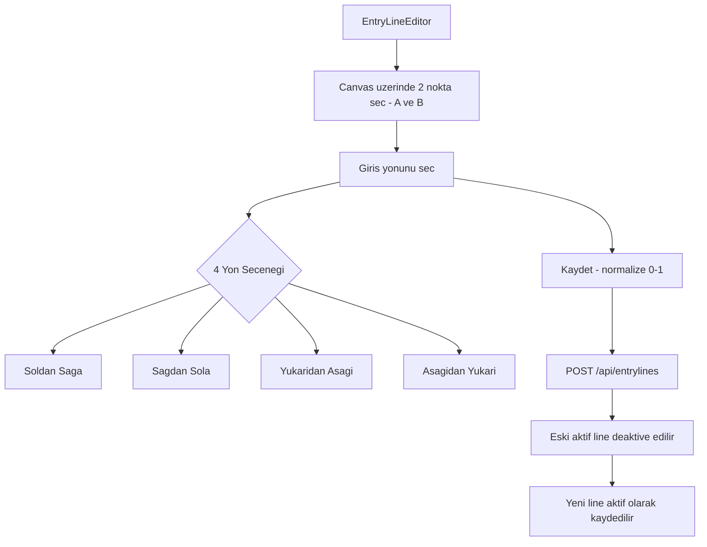

### 9.3 Gecis Algilama Is Kurallari

1. **Cizgi Kesisimi**: Onceki ve mevcut centroid arasindaki hareket vektoru, entry line ile kesisim testi (cross product yontemi)
2. **Yon Belirleme**: Hareket vektoru ve cizgi vektoru arasindaki cross product isareti yon belirler
3. **Giris/Cikis State Machine**: `none -> entered/exited -> (ters yon) karsi duruma gecis`
4. **Koruma Mekanizmalari**:
   - Track yasi < 3 frame: atlanir
   - Son gecisten beri < 1000ms: atlanir (cooldown)
   - Ayni yon tekrar: gormezden gelinir (glitch onlemi)

---

## 10. Gercek Zamanli Iletisim

**Onemli Tespit**: Projede SignalR veya WebSocket kullanilmamaktadir. Gercek zamanli guncelleme **polling** yontemi ile saglanir:

| Veri | Yenileme Stratejisi |
|------|---------------------|
| Gunluk Ozet | React Query refetchInterval: 60 sn |
| Son Heatmap | React Query refetchInterval: 30 sn |
| Tespit Verisi | Kullanici "Verileri Gonder" tiklar (manuel gonderim) |
| Chat | Istek/yanit seklinde (mutation) |

Nesne algilama tamamen tarayici ici gerceklestirilir ve veri gonderimi kullanicinin istemine baglidir.

---

## 11. Sistem Akis Diyagrami (Uctan Uca)

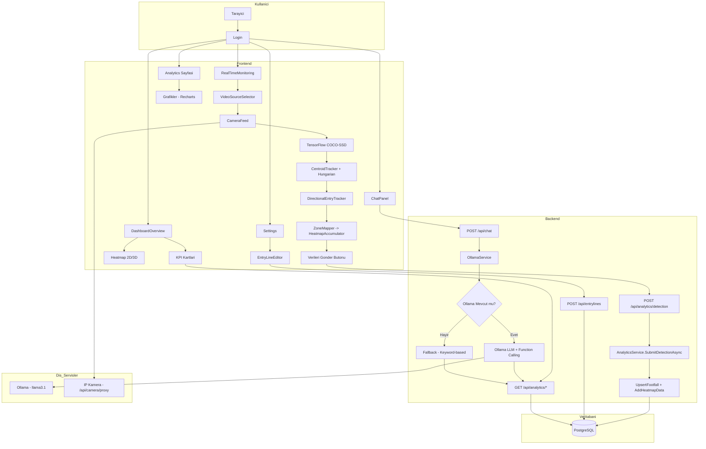

---

## 12. Is Kurallari Ozeti

| # | Is Kurali | Konum | Aciklama |
|---|-----------|-------|----------|
| BR-01 | Tek aktif entry line | EntryLineService.cs | Yeni entry line olusturuldiginda magaza icin onceki tum aktif entry line'lar deaktive edilir |
| BR-02 | Soft delete | EntryLineService.cs | Entry line silindiginde fiziksel olarak kaldirilmaz, `IsActive=false` yapilir |
| BR-03 | Footfall upsert | AnalyticsRepository.cs | Ayni StoreId+Date+Hour icin mevcut kayit varsa EntryCount toplanir, PeakOccupancy max alinir |
| BR-04 | Kisi tespiti esigi | usePersonDetection.ts | Yalnizca `score >= 0.55` olan "person" sinifi tespitler dikkate alinir |
| BR-05 | Tespit throttle | usePersonDetection.ts | Tespit islemi ~10 FPS'e (100ms aralik) sinirlandirilir |
| BR-06 | Track onaylama | centroidTracker.ts | Bir nesne 3 frame boyunca takip edildikten sonra "benzersiz ziyaretci" sayilir |
| BR-07 | Kaybolma esigi | centroidTracker.ts | 30 frame boyunca gorulmeyen nesne takipten cikarilir |
| BR-08 | Gecis cooldown | directionalEntryTracker.ts | Ayni nesne entry line'i son 1 saniye icinde gectiyse yeni gecis sayilmaz |
| BR-09 | Heatmap snapshot | DetectionPanel.tsx | Her 1 saniyede bir zonlar icin snapshot alinir (max 60 saklanir) |
| BR-10 | JWT suresi | AuthService.cs | Token 1 saat gecerlidir |
| BR-11 | SSRF korumasi | CameraProxyController.cs | Kamera proxy yalnizca ozel ag adreslerine izin verir |
| BR-12 | Magaza calisma saatleri | DataSeeder.cs | Seed verisinde saat 09:00-21:00 arasi trafik simulasyonu yapilir |
| BR-13 | Adaptif eslestirme mesafesi | centroidTracker.ts | Tracker'in max mesafesi bounding box boyutuna gore dinamik ayarlanir |
| BR-14 | IoU tabanli maliyet | centroidTracker.ts | Eslestirme maliyeti `centroidDist * (1 - IoU * 0.5)` formulu ile hesaplanir |
| BR-15 | Dil destegi | OllamaService.cs | Chatbot Turkce soru gelirse Turkce, Ingilizce gelirse Ingilizce yanit verir |

---

## 13. Teknik Borc ve Iyilestirme Alanlari

| # | Konu | Dosya | Aciklama |
|---|------|-------|----------|
| TD-01 | In-memory refresh token | AuthService.cs | Sunucu yeniden baslatildiginda tum oturumlar kapanir. Veritabanina tasinmali. |
| TD-02 | Tek kullanici sistemi | AuthService.cs | Kullanici yonetimi yok, yalnizca config dosyasindaki kullanici ile giris yapilir |
| TD-03 | WeatherForecastController | WeatherForecastController.cs | Sablon controller, kullanilmiyor, temizlenmeli |
| TD-04 | Migration dosyasi yok | HeatTheMap.Api/Migrations/ | `EnsureCreatedAsync` + raw SQL kullaniliyor, EF Core migration'larina gecis yapilmali |
| TD-05 | Real-time iletisim yok | - | Polling yerine SignalR/WebSocket kullanilabilir |
| TD-06 | Manuel veri gonderimi | DetectionPanel.tsx | Kullanici "Verileri Gonder" tiklayarak manuel veri gonderiyor, otomatik olabilir |
| TD-07 | Hata yonetimi | Tum controller'lar | Genel `Exception` yakalamalari, spesifik hata turleri kullanilmali |
| TD-08 | Hardcoded JWT key | appsettings.json | Uretim ortaminda guvenli secret yonetimi (Azure Key Vault vb.) kullanilmali |

---

## Temel Dosya Referanslari

| Alan | Dosya Yolu |
|------|-----------|
| Orkestrasyon | `AppHost.cs` |
| API Baslangic | `HeatTheMap.Api/Program.cs` |
| Veritabani Context | `HeatTheMap.Api/Data/HeatMapDbContext.cs` |
| Entity'ler | `HeatTheMap.Api/Data/Entities/` (5 dosya) |
| Controller'lar | `HeatTheMap.Api/Controllers/` (6 dosya) |
| Servisler | `HeatTheMap.Api/Services/` (8 dosya) |
| Nesne Takip | `HeatTheMap.Web/src/lib/centroidTracker.ts` |
| Giris Takip | `HeatTheMap.Web/src/lib/directionalEntryTracker.ts` |
| Hungarian Algoritma | `HeatTheMap.Web/src/lib/hungarian.ts` |
| Heatmap Biriktirici | `HeatTheMap.Web/src/lib/heatmapAccumulator.ts` |
| Zon Esleme | `HeatTheMap.Web/src/lib/zoneMapper.ts` |
| AI Servisi | `HeatTheMap.Api/Services/OllamaService.cs` |
| Frontend Routing | `HeatTheMap.Web/src/App.tsx` |
| Detection Hook | `HeatTheMap.Web/src/components/detection/usePersonDetection.ts` |
